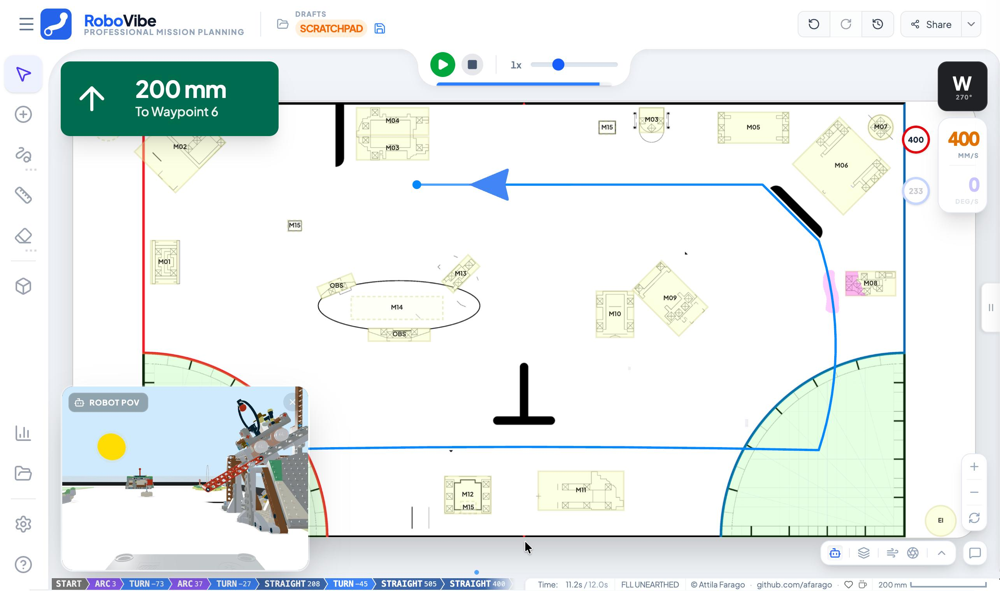

# RoboVibe - Strategy and Mission Planning

RoboVibe is an interactive, visual path-planning and strategy platform for mobile robots. It combines precise field mapping, physics-based simulation, and comprehensive mission management to help teams, educators, and hobbyists design reliable robot runs.

<iframe width="560" height="315" src="https://www.youtube.com/embed/PO5JEWvFGsc" title="YouTube video player" frameborder="0" allow="accelerometer; autoplay; clipboard-write; encrypted-media; gyroscope; picture-in-picture; web-share" referrerpolicy="strict-origin-when-cross-origin" allowfullscreen></iframe>

## Interactive Mission Planning

Designing reliable robot missions requires more than just drawing a line. It demands accurate geometry, an understanding of physics, and strategic scoring. RoboVibe addresses critical challenges in competitive robotics:

- **Precision**: Design on a 1:1 scale field map where every millimeter counts.
- **Physics Intuition**: Visualize wheel slip, friction, and dynamic errors _before_ you run the robot.
- **Strategy & Scoring**: Manage mission objectives, track scores, and optimize your run for maximum points.
- **Reproducibility**: Export clean, kinematic-aware code (Python/Pybricks) ready for your robot.

## Core Pillars

### 🗺️ Interactive Map Canvas

Precise, vector-based path editing with smart snapping and arc tools. Switch between 2D planning and 3D visualization. Easily convert straight lines to smooth curves with adjustable handles.

### ⚛️ Physics & Simulation

Simulation of wheel slip, centrifugal forces, and robot dynamics. Real-time feedback on acceleration limits and friction coefficients helps catch geometry and physics errors in simulation, saving battery and table time.

### 🏆 Mission & Strategy

Integrated scoring, mission badges, and strategy visualization. Define and track mission objectives with automatic score calculation. Presentation mode simplifies team reviews.

### ☁️ Cloud & Collaboration

Real-time synchronization of projects and programs using Firebase. Design on a tablet, refine on a laptop. Your whole team stays on the same page.

### ⌨️ Productivity & Export

Instant export to structured command sequences compatible with Pybricks, SPIKE, and more. Use keyboard shortcuts (Arrow keys, WASD) and playback panels to verify logic step-by-step.

---

## Detailed Features

### Mission Planning & Editing

- **Projects & Programs**: Organize, save, and load custom missions.
- **Add Waypoint**: Drop target coordinate pins across the field map.
- **Draw Path**: Freehand sketching tool processed into traversable waypoints.
- **Measure Tool**: Calculate distance and angle between distinct points.

### Strategy & Analytics

- **AI Path Planner**: Leverage AI to calculate the most efficient travel path.
- **Scoring View**: Monitor exact score and objectives in real-time.
- **Score Density**: Heat-map visualization pinpointing lucrative target areas.
- **Analytics & Reports**: Metrics about path complexity, expected runtime, and efficiency.

### Visualization & Simulation

- **3D Simulate**: Evaluate 2D plans in a fully interactive 3D environment.
- **AR Verifier**: Project mapped digital waypoints onto the real-world playing field using Augmented Reality.
- **Presentation Mode**: Distraction-free layout tailored for clear visual communication.

---

## Technical Stack

- **Frontend**: React 18, TypeScript, Vite
- **Styling**: Tailwind CSS
- **Backend**: Firebase (Cloud Sync)
- **Rendering**: SVG for path rendering, 3D experimental engine for glTF models
- **Integration**: Pybricks Python bindings

---

## Usage & Controls

### Basic Path Creation

1. **Add waypoints**: Click on the map to add points
2. **Move waypoints**: Drag the white circular handles
3. **Create curves**: Drag the white handle at the segment midpoint
4. **Adjust heading**: Select the last waypoint and use Left/Right arrows
5. **Delete waypoints**: Select and press Delete/Backspace

### Keyboard Shortcuts

| Key                     | Action                         |
| ----------------------- | ------------------------------ |
| `Click`                 | Add waypoint                   |
| `Drag`                  | Move waypoint                  |
| `Double-click waypoint` | Remove waypoint                |
| `Left/Right Arrow`      | Rotate last waypoint ±15°      |
| `Up/Down Arrow`         | Extend path from last waypoint |
| `Delete/Backspace`      | Remove selected waypoint       |
| `Ctrl/Cmd + Z`          | Undo                           |
| `Shift + Drag`          | Bypass angle snapping          |

---

## Get Started

The community version of RoboVibe is available on GitHub. You can explore the code, contribute, or set up your own instance.

[RoboVibe Community on GitHub](https://github.com/afarago/robovibe-community){: .btn .btn-primary }
